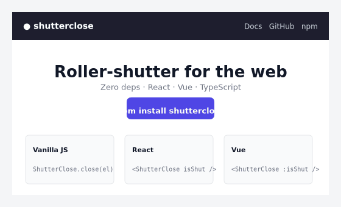

<div align="center">

# shutterclose

**An animated roller-shutter effect for any HTML element.**



[](https://www.npmjs.com/package/shutterclose)
[](https://bundlephobia.com/package/shutterclose)
[](https://www.typescriptlang.org/)
[](LICENSE)
[](https://github.com/alew140/shutterclose/actions)

</div>

Cover any HTML element with smooth, mechanical sliding slats and a customizable sign. Perfect for maintenance screens, content gates, modal overlays, and creative UI moments. Ships with vanilla, React, and Vue bindings, strict TypeScript types, and zero runtime dependencies.

## Table of Contents

- [Why shutterclose?](#why-shutterclose)
- [Installation](#installation)
- [Quick Start](#quick-start)
- [Real-world examples](#real-world-examples)
- [Themes](#themes)
- [API Reference](#api-reference)
  - [Static API](#static-api)
  - [Instance API](#instance-api)
  - [Options](#options)
  - [React](#react)
  - [Vue](#vue)
- [CDN / Browser Usage](#cdn--browser-usage)
- [CSS Control](#css-control)
- [Server-Side Rendering](#server-side-rendering)
- [TypeScript](#typescript)
- [Error Handling](#error-handling)
- [Contributing](#contributing)
- [License](#license)

## Why shutterclose?

- **A genuinely unique effect.** Decelerating slats with overshoot give content a physical, mechanical feel that no generic fade or slide reproduces.
- **Zero runtime dependencies.** Pure JavaScript and CSS. Nothing else lands in your `node_modules`.
- **Framework agnostic.** First-class bindings for React and Vue, plus a vanilla API that works anywhere the DOM does.
- **Tiny.** Under 2 KB gzipped for the core. Subpath exports let you ship only the binding you use.

## Installation

```bash
npm install shutterclose
# pnpm add shutterclose
# yarn add shutterclose
```

No build step? Load it straight from a CDN — see [CDN / Browser Usage](#cdn--browser-usage).

## Quick Start

### Vanilla

```javascript
import ShutterClose from 'shutterclose'

// Close an element
await ShutterClose.close('#hero', {
  sign: { icon: '🔒', title: 'CLOSED', subtitle: 'Come back soon' }
})

// Open it again
await ShutterClose.open('#hero')
```

### React

```jsx
import { useState } from 'react'
import { ShutterClose } from 'shutterclose/react'

export function PricingCard() {
  const [locked, setLocked] = useState(false)

  return (
    <ShutterClose
      isShut={locked}
      sign={{ icon: '⭐', title: 'PRO ONLY', subtitle: 'Upgrade to unlock', theme: 'gold' }}
      onClosed={() => console.log('locked')}
    >
      <h2>Advanced Analytics</h2>
      <button onClick={() => setLocked(true)}>Lock</button>
    </ShutterClose>
  )
}
```

### Vue

```vue
<script setup>
import { ref } from 'vue'
import { ShutterClose } from 'shutterclose/vue'

const locked = ref(false)
</script>

<template>
  <ShutterClose
    :is-shut="locked"
    :sign="{ icon: '⭐', title: 'PRO ONLY', subtitle: 'Upgrade to unlock', theme: 'gold' }"
  >
    <h2>Advanced Analytics</h2>
    <button @click="locked = true">Lock</button>
  </ShutterClose>
</template>
```

## Real-world examples

### Maintenance window

Shut the whole page down and bring it back automatically.

```javascript
import ShutterClose from 'shutterclose'

async function startMaintenance(durationMs) {
  await ShutterClose.close(document.body, {
    slats: 12,
    duration: 1.5,
    sign: {
      icon: '🔧',
      title: 'UNDER MAINTENANCE',
      subtitle: 'Back online shortly',
      theme: 'gold',
    },
  })

  await new Promise(r => setTimeout(r, durationMs))
  await ShutterClose.open(document.body)
}

startMaintenance(15_000) // back in 15 seconds
```

### Premium content gate

Lock sections until the user upgrades — no page navigation needed.

```javascript
const gate = ShutterClose.target('#premium-section')
  .slats(8)
  .duration(1.2)
  .sign({ icon: '⭐', title: 'PRO PLAN', subtitle: 'Upgrade to unlock', theme: 'gold' })

// Lock on page load
gate.close()

// Unlock after purchase
document.getElementById('upgrade-btn').addEventListener('click', async () => {
  const ok = await purchaseUpgrade()
  if (ok) gate.open()
})
```

### React — dashboard panel with loading state

```jsx
import { useShutterClose } from 'shutterclose/react'
import { useRef, useEffect } from 'react'

export function RevenueChart({ isLoading }) {
  const ref = useRef(null)
  const { close, open } = useShutterClose(ref, {
    sign: { icon: '⏳', title: 'LOADING DATA', theme: 'blue' },
  })

  useEffect(() => {
    if (isLoading) close()
    else open()
  }, [isLoading])

  return (
    <div ref={ref} className="chart-panel">
      <Chart />
    </div>
  )
}
```

### Fluent builder — reusable instance

```javascript
const shutter = ShutterClose.target('.modal')
  .slats(16)
  .duration(1.8)
  .deceleration(95)
  .sign({ icon: '🔒', title: 'SESSION EXPIRED', subtitle: 'Please log in again', theme: 'red' })
  .onClose(() => analytics.track('session_expired'))
  .onOpen(() => router.push('/login'))

// Later — trigger from anywhere
await shutter.close()
```

### Global defaults — configure once for your whole app

```javascript
import ShutterClose from 'shutterclose'

ShutterClose.configure({
  defaults: {
    slats: 10,
    duration: 1.4,
    sign: { icon: '🔒', title: 'RESTRICTED' },
  },
})

// Every subsequent call inherits these defaults
await ShutterClose.close('#section-a')
await ShutterClose.close('#section-b', { sign: { title: 'PREMIUM ONLY', theme: 'gold' } })
```

## Themes

Six built-in sign themes, applied via `sign.theme`:

| Theme | Use case |
|-------|----------|
| `default` | General closed state (orange / amber) |
| `blue` | Informational overlays |
| `green` | Available / online / success |
| `purple` | Branded or premium UI |
| `gold` | Maintenance, upgrades, highlights |
| `red` | Restricted, error, blocked access |

```javascript
await ShutterClose.close('.section', {
  sign: { icon: '⚠️', title: 'RESTRICTED', theme: 'red' }
})
```

## API Reference

### Static API

The default export exposes a static surface for one-off calls, global configuration, and a fluent builder.

#### `ShutterClose.close`

```typescript
ShutterClose.close(target: Target, options?: ShutterCloseOptions): Promise<void>
```

Covers the target with the shutter animation. Resolves when the close animation completes.

```javascript
await ShutterClose.close('#modal', {
  slats: 12,
  duration: 1.5,
  sign: { icon: '🔒', title: 'CLOSED', theme: 'red' },
})
```

#### `ShutterClose.open`

```typescript
ShutterClose.open(target: Target): Promise<void>
```

Reveals a previously closed target. Resolves when the open animation completes.

```javascript
await ShutterClose.open('#modal')
```

#### `ShutterClose.target`

```typescript
ShutterClose.target(target: Target): ShutterCloseBuilder
```

Returns a reusable, chainable builder for declarative configuration.

```javascript
const shutter = ShutterClose.target('.panel')
  .slats(16)
  .duration(1.8)
  .sign({ title: 'CLOSED', subtitle: 'Please try again later' })
  .onClose(() => console.log('closed'))
  .onOpen(() => console.log('opened'))

await shutter.close()
await shutter.open()
```

| Method | Description |
|--------|-------------|
| `.slats(count)` | Number of slats (default: 8) |
| `.duration(seconds)` | Animation duration (default: 2) |
| `.heightMultiplier(mult)` | Slat starting-height multiplier (default: 3) |
| `.deceleration(percent)` | Easing deceleration, 0–100 (default: 97) |
| `.easing(curve)` | Custom CSS easing string |
| `.theme(name)` | Built-in sign theme |
| `.sign(config)` | Sign configuration |
| `.onClose(fn)` | Callback after close completes |
| `.onOpen(fn)` | Callback after open completes |
| `.close()` | Execute the close animation |
| `.open()` | Execute the open animation |

#### `ShutterClose.configure`

```typescript
ShutterClose.configure(config: GlobalConfig): void
```

Sets global defaults shared by every instance and static call.

```javascript
ShutterClose.configure({
  injectCSS: true,
  defaults: { slats: 10, duration: 1.5 },
})
```

### Instance API

```typescript
new ShutterClose(target: Target, options?: ShutterCloseOptions)
```

Construct an instance for fine-grained, stateful control over a single target.

```javascript
const instance = new ShutterClose('.overlay', {
  slats: 12,
  sign: { title: 'CLOSED' },
})

await instance.close()
console.log(instance.isShut) // true
await instance.open()
instance.destroy()
```

| Member | Signature | Description |
|--------|-----------|-------------|
| `isShut` | `boolean` (read-only) | Whether the target is currently closed |
| `close()` | `() => Promise<void>` | Run the close animation |
| `open()` | `() => Promise<void>` | Run the open animation |
| `destroy()` | `() => void` | Tear down and remove the overlay |

### Options

Every option is optional and merges over the configured global defaults.

| Property | Type | Default | Description |
|----------|------|---------|-------------|
| `slats` | `number` | `8` | Number of horizontal slats |
| `duration` | `number` | `2` | Animation duration in seconds |
| `heightMultiplier` | `number` | `3` | Slat starting-height multiplier for overshoot |
| `deceleration` | `number` | `97` | Easing deceleration percentage, 0–100 |
| `easing` | `string` | — | Custom CSS easing curve, overrides `deceleration` |
| `sign` | `SignConfig` | — | Closed-sign configuration |
| `onClose` | `() => void` | — | Fires after the close animation completes |
| `onOpen` | `() => void` | — | Fires after the open animation completes |

#### SignConfig

| Property | Type | Required | Description |
|----------|------|----------|-------------|
| `title` | `string` | Yes | Main text on the sign |
| `subtitle` | `string` | No | Secondary text below the title |
| `icon` | `string` | No | Icon or emoji, e.g. `🔒`, `⚠️` |
| `theme` | `Theme` | No | One of the six built-in themes |

### React

Import from `shutterclose/react`.

#### `useShutterClose`

```jsx
import { useRef } from 'react'
import { useShutterClose } from 'shutterclose/react'

export function Panel() {
  const ref = useRef(null)
  const { close, open, toggle, isShut } = useShutterClose(ref, {
    slats: 12,
    sign: { icon: '🔒', title: 'CLOSED', theme: 'red' },
  })

  return (
    <div ref={ref} style={{ position: 'relative' }}>
      <p>{isShut ? 'Locked' : 'Open'}</p>
      <button onClick={toggle}>Toggle</button>
    </div>
  )
}
```

| Returned | Type | Description |
|----------|------|-------------|
| `close()` | `() => Promise<void>` | Close the shutter |
| `open()` | `() => Promise<void>` | Open the shutter |
| `toggle()` | `() => Promise<void>` | Toggle current state |
| `isShut` | `boolean` | Current closed state |

#### `<ShutterClose />`

```jsx
import { ShutterClose } from 'shutterclose/react'

<ShutterClose
  isShut={locked}
  slats={12}
  duration={1.5}
  sign={{ icon: '🔒', title: 'CLOSED', theme: 'red' }}
  onClosed={() => analytics.track('locked')}
  onOpened={() => analytics.track('unlocked')}
  className="panel"
>
  <YourContent />
</ShutterClose>
```

| Prop | Type | Default | Description |
|------|------|---------|-------------|
| `isShut` | `boolean` | `false` | Controlled closed state |
| `onClosed` | `() => void` | — | Fires when close completes |
| `onOpened` | `() => void` | — | Fires when open completes |
| `className` | `string` | — | Class for the wrapper div |
| `style` | `CSSProperties` | — | Inline styles for the wrapper div |
| _...options_ | — | — | All [Options](#options) are accepted as props |

### Vue

Import from `shutterclose/vue`.

#### `useShutterClose`

```vue
<script setup>
import { ref } from 'vue'
import { useShutterClose } from 'shutterclose/vue'

const el = ref(null)
const { close, open, toggle, isShut } = useShutterClose(el, {
  slats: 12,
  sign: { icon: '🔒', title: 'CLOSED', theme: 'red' },
})
</script>

<template>
  <div ref="el" style="position: relative">
    <p>{{ isShut ? 'Locked' : 'Open' }}</p>
    <button @click="toggle">Toggle</button>
  </div>
</template>
```

| Returned | Type | Description |
|----------|------|-------------|
| `close()` | `() => Promise<void>` | Close the shutter |
| `open()` | `() => Promise<void>` | Open the shutter |
| `toggle()` | `() => Promise<void>` | Toggle current state |
| `isShut` | `Ref<boolean>` | Reactive closed state |

#### `<ShutterClose />`

```vue
<ShutterClose
  :is-shut="locked"
  :slats="12"
  :duration="1.5"
  :sign="{ icon: '🔒', title: 'CLOSED', theme: 'red' }"
  class="panel"
  @closed="onClosed"
  @opened="onOpened"
>
  <YourContent />
</ShutterClose>
```

| Prop | Type | Default | Description |
|------|------|---------|-------------|
| `isShut` | `boolean` | `false` | Controlled closed state |
| `class` | `string` | — | Class for the wrapper div |
| _...options_ | — | — | All [Options](#options) are accepted as props |

| Event | Description |
|-------|-------------|
| `closed` | Emitted when the close animation completes |
| `opened` | Emitted when the open animation completes |

## CDN / Browser Usage

The IIFE build exposes a global named `ShutterClose`.

```html
<!DOCTYPE html>
<html>
  <head>
    <link rel="stylesheet" href="https://unpkg.com/shutterclose/dist/shutterclose.css">
  </head>
  <body>
    <main id="app">
      <h1>Welcome</h1>
    </main>

    <script src="https://unpkg.com/shutterclose/dist/index.global.js"></script>
    <script>
      const { ShutterClose } = window.ShutterClose

      // Close for 10 seconds, then reopen
      ShutterClose.close('#app', {
        slats: 10,
        sign: { icon: '🔧', title: 'MAINTENANCE', subtitle: 'Back in 10 seconds', theme: 'gold' }
      }).then(() => setTimeout(() => ShutterClose.open('#app'), 10_000))
    </script>
  </body>
</html>
```

## CSS Control

Styles are auto-injected by default — no extra setup needed.

```javascript
import ShutterClose from 'shutterclose' // CSS injected automatically
```

For full control over load order or bundlers that manage CSS:

```javascript
import ShutterClose from 'shutterclose/no-css'
import 'shutterclose/shutterclose.css'

ShutterClose.configure({ injectCSS: false })
```

The stylesheet exposes CSS custom properties for theming:

```css
.sc-shutter { --sc-duration: 2s; --sc-start-y: -300%; }
.sc-slat    { background: linear-gradient(135deg, #333 0%, #444 100%); }
```

## Server-Side Rendering

The CSS injector guards on `typeof document === 'undefined'`, so importing shutterclose is safe in SSR environments such as Next.js and Nuxt.

## TypeScript

shutterclose is authored in strict TypeScript and ships complete `.d.ts` declarations for every entry point.

```typescript
import type { ShutterCloseOptions, SignConfig, Theme, GlobalConfig } from 'shutterclose'
import ShutterClose from 'shutterclose'

const opts: ShutterCloseOptions = {
  slats: 10,
  sign: { icon: '🔒', title: 'CLOSED', theme: 'red' satisfies Theme },
}

await ShutterClose.close('.modal', opts)
```

Exported types: `ShutterCloseOptions`, `SignConfig`, `Theme`, `Target`, `GlobalConfig`, `ShutterCloseTargetError`.

## Error Handling

`ShutterCloseTargetError` is thrown when a selector matches no element.

```javascript
import ShutterClose, { ShutterCloseTargetError } from 'shutterclose'

try {
  await ShutterClose.close('.does-not-exist')
} catch (err) {
  if (err instanceof ShutterCloseTargetError) {
    console.error('Target not found:', err.message)
  }
}
```

## Contributing

Contributions are welcome. Open an issue or a pull request on [GitHub](https://github.com/alew140/shutterclose). CI runs on Node 18 and 20, and releases are managed with Changesets.

## License

MIT. See [LICENSE](LICENSE) for details.
